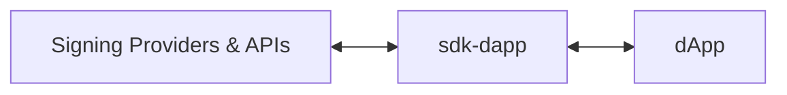
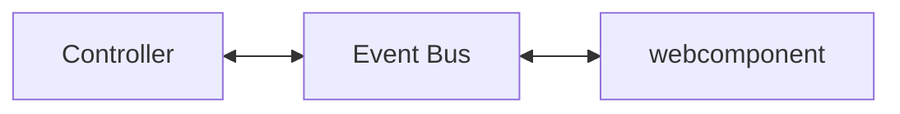

# MultiversX SDK for Front-End DApps

[](https://github.com/multiversx/mx-sdk-dapp/actions/workflows/pre-merge-main-unit-tests.yml)
[](https://github.com/multiversx/mx-sdk-dapp/actions/workflows/run-template-dapps-integration.yml)
[](https://deepwiki.com/multiversx/mx-sdk-dapp)

MultiversX Front-End SDK for JavaScript and TypeScript (written in TypeScript).

## Introduction

`sdk-dapp` is a library that holds core functional logic that can be used to create a dApp on MultiversX Network.

It is built for applications that use any of the following technologies:

- React (example: [React Template Dapp](https://github.com/multiversx/mx-template-dapp))
- Angular (example: [Angular Template Dapp](https://github.com/multiversx/mx-template-dapp-angular))
- Vue (example: [Vue Template Dapp](https://github.com/multiversx/mx-template-dapp-vue))
- Any other JavaScript framework (e.g. Solid.js etc.) (example: [Solid.js Dapp](https://github.com/multiversx/mx-solidjs-template-dapp))
- React Native
- Next.js (example: [Next.js Dapp](https://github.com/multiversx/mx-template-dapp-nextjs))

## GitHub project

The GitHub repository can be found here: [https://github.com/multiversx/mx-sdk-dapp](https://github.com/multiversx/mx-sdk-dapp)

## Live demo: template-dapp

See [Template dApp](https://template-dapp.multiversx.com/) for live demo or check out usage in the [Github repo](https://github.com/multiversx/mx-template-dapp)

## Requirements

- Node.js version 20.13.1+
- Npm version 10.5.2+

## Distribution

[npm](https://www.npmjs.com/package/@multiversx/sdk-dapp)

## Installation

The library can be installed via npm or yarn.

```bash
npm install @multiversx/sdk-dapp
```

or

```bash
yarn add @multiversx/sdk-dapp
```
> **Note:** Make sure you run your app on `https`, not `http`, otherwise some providers will not work.

If you're transitioning from `@multiversx/sdk-dapp@4.x`, you can check out the [Migration guide](https://github.com/multiversx/mx-template-dapp/blob/main/MIGRATION_GUIDE.md) and the [migration PR](https://github.com/multiversx/mx-template-dapp/pull/343) of Template Dapp

## Usage

sdk-dapp aims to abstract and simplify the process of interacting with users' wallets and with the MultiversX blockchain, allowing developers to easily get started with new applications.



The basic concepts you need to understand are configuration, provider interaction, transactions, and presenting data. These are the building blocks of any dApp, and they are abstracted in the `sdk-dapp` library.

Having this knowledge, we can consider several steps needed to put a dApp together:

**Table 1**. Steps to build a dApp
| # | Step | Description |
|---|------|-------------|
| 1 | Configuration | - storage configuration (e.g. sessionStorage, localStorage etc.)<br>- chain configuration<br>- custom provider configuration (adding / disabling / changing providers) |
| 2 | Provider interaction | - logging in and out<br>- signing transactions / messages |
| 3 | Presenting data | - get store data (e.g. account balance, account address etc.)<br>- use components to display data (e.g. balance, address, transactions list) |
| 4 | Transactions | - sending transactions<br>- tracking transactions<br>- displayingtransactions history |

Each of these steps will be explained in more detail in the following sections.

### 1. Configuration

Before your application bootstraps, you need to configure the storage, the network, and the signing providers. This is done by calling the `initApp` method from the `methods` folder. It is recommended to call this method in the `index.tsx` to ensure the sdk-dapp internal functions are initialized before rendering the app.

```typescript
// index.tsx
import { initApp } from '@multiversx/sdk-dapp/out/methods/initApp/initApp';
import type { InitAppType } from '@multiversx/sdk-dapp/out/methods/initApp/initApp.types';
import { EnvironmentsEnum } from '@multiversx/sdk-dapp/out/types/enums.types';
import { App } from "./App";

const config: InitAppType = {
  storage: { getStorageCallback: () => sessionStorage },
  dAppConfig: {
    // nativeAuth: true, // optional
    environment: EnvironmentsEnum.devnet,
    // network: { // optional
    //   walletAddress: 'https://devnet-wallet.multiversx.com' // or other props you want to override
    // },
    // transactionTracking: { // optional
    //   successfulToastLifetime: 5000,
    //   onSuccess: async (sessionId) => {
    //     console.log('Transaction session successful', sessionId);
    //   },
    //   onFail: async (sessionId) => {
    //     console.log('Transaction session failed', sessionId);
    // }
  }
  // customProviders: [myCustomProvider] // optional
};

initApp(config).then(() => {
  render(() => <App />, root!); // render your app
});
```

### 2. Provider interaction

Once your dApp has loaded, the first user action is logging in with a chosen provider. There are two ways to perform a login: using the `UnlockPanelManager` and programmatic login using the `ProviderFactory`.

#### 2.1 Using the `UnlockPanelManager`
By using the provided UI, you get the benefit of having all supported providers ready for login in a side panel. You simply need to link the `unlockPanelManager.openUnlockPanel` to a user action.

```typescript
import { UnlockPanelManager } from '@multiversx/sdk-dapp/out/managers/UnlockPanelManager';
import { ProviderFactory } from '@multiversx/sdk-dapp/out/providers/ProviderFactory';

export const ConnectButton = () => {
  const unlockPanelManager = UnlockPanelManager.init({
    loginHandler: () => {
      navigate('/dashboard');
    },
    onClose: () => { // optional action to be performed when the user closes the Unlock Panel
      navigate('/');
    },
    // allowedProviders: [ProviderTypeEnum.walletConnect, 'myCustomProvider'] // optionally, only show specific providers
  });
  const handleOpenUnlockPanel = () => {
    unlockPanelManager.openUnlockPanel();
  };
  return <Button onClick={handleOpenUnlockPanel}>Connect</Button>;
};

```
Once the user has logged in, if `nativeAuth` is configured in the `initApp` method, an automatic logout will be performed upon native auth expiration. Before the actual logout is performed, the `LogoutManager` will show a warning toast to the user. This toast can be customized by passing a `tokenExpirationToastWarningSeconds` to the `nativeAuth` config.

```typescript
// in initApp config
const config: InitAppType = {
 // ...
 nativeAuth: {
    expirySeconds: 30, // test auto logout after 30 seconds
    tokenExpirationToastWarningSeconds: 10 // show warning toast 10 seconds before auto logout
 },
}
```

You have the option to stop this behavior by calling `LogoutManager.getInstance().stop()` after the user has logged in.

```typescript
import { LogoutManager } from '@multiversx/sdk-dapp/out/managers/LogoutManager/LogoutManager';

  loginHandler: () => {
    navigate('/dashboard');
    // optional, to stop the automatic logout upon native auth expiration
    LogoutManager.getInstance().stop(); 
  },
```

If you want to perform some actions as soon as the user has logged in, you will need to call `ProviderFactory.create` inside a handler accepting arguments. 

```typescript
export const AdvancedConnectButton = () => {
  const unlockPanelManager = UnlockPanelManager.init({
    loginHandler: async ({ type, anchor }) => {
      const provider = await ProviderFactory.create({
        type,
        anchor
      });
      const { address, signature } = await provider.login();
      navigate(`/dashboard?address=${address}`);
    },
  });
  const handleOpenUnlockPanel = () => {
    unlockPanelManager.openUnlockPanel();
  };
  return <Button onClick={handleOpenUnlockPanel}>Advanced Connect</Button>;
};

```

#### 2.2 Programatic login using the `ProviderFactory`
If you want to login using your custom UI, you can link user actions to specific providers by calling the `ProviderFactory`.

```typescript
import { ProviderTypeEnum } from '@multiversx/sdk-dapp/out/providers/types/providerFactory.types';

const provider = await ProviderFactory.create({
  type: ProviderTypeEnum.extension
});
await provider.login();
```

> **Note:** Extension and Ledger login will only work if dApp is served over HTTPS protocol

### 3. Displaying app data

Depending on the framework, you can either use hooks or selectors to get the user details:

#### 3.1 React hooks

If you are using React, all hooks can be found under the `/out/react` folder. All store information can be accessed via different hooks, but below you will find the main hooks related to the most common use cases

```bash
out/react/
├── account/useGetAccount ### access account data like address, balance and nonce
├── loginInfo/useGetLoginInfo ### access login data like accessToken and provider type
├── network/useGetNetworkConfig ### access network information like chainId and egldLabel
├── store/useSelector ### make use of the useSelector hook for querying the store via selectors
└── transactions/useGetTransactionSessions ### access all current and historic transaction sessions
```

Below is an example of using the hooks to display the user address and balance.

```typescript
import { useGetAccount } from '@multiversx/sdk-dapp/out/react/account/useGetAccount';
import { useGetNetworkConfig } from '@multiversx/sdk-dapp/out/react/network/useGetNetworkConfig';

const account = useGetAccount();
const {
  network: { egldLabel }
} = useGetNetworkConfig();

console.log(account.address);
console.log(`${account.balance} ${egldLabel}`);
```

#### 3.2 Store selector functions:

If you are not using the React ecosystem, you can use store selectors to get the store data, but note that information will not be reactive unless you subscribe to store changes.

```typescript
import { getAccount } from '@multiversx/sdk-dapp/out/methods/account/getAccount';
import { getNetworkConfig } from '@multiversx/sdk-dapp/out/methods/network/getNetworkConfig';

const account = getAccount();
const { egldLabel } = getNetworkConfig();
```

In order to get live updates you may need to subscribe to the store like this:

```typescript
import { createSignal, onCleanup } from 'solid-js';
import { getStore } from '@multiversx/sdk-dapp/out/store/store';

export function useStore() {
  const store = getStore();
  const [state, setState] = createSignal(store.getState());

  const unsubscribe = store.subscribe((newState) => {
    setState(newState);
  });

  onCleanup(() => unsubscribe());

  return state;
}
```

### 4. Transactions

#### 4.1 Signing transactions

To sign transactions, you first need to create the `Transaction` object, then pass it to the initialized provider.

```typescript
import { Address, Transaction } from '@multiversx/sdk-core';
import {
  GAS_PRICE,
  GAS_LIMIT
} from '@multiversx/sdk-dapp/out/constants/mvx.constants';
import { getAccountProvider } from '@multiversx/sdk-dapp/out/providers/helpers/accountProvider';
import { refreshAccount } from '@multiversx/sdk-dapp/out/utils/account/refreshAccount';

const pongTransaction = new Transaction({
  value: BigInt(0),
  data: Buffer.from('pong'),
  receiver: Address.newFromBech32(contractAddress),
  gasLimit: BigInt(GAS_LIMIT),
  gasPrice: BigInt(GAS_PRICE),
  chainID: network.chainId,
  nonce: BigInt(account.nonce),
  sender: Address.newFromBech32(account.address),
  version: 1
});

await refreshAccount(); // optionally, to get the latest nonce
const provider = getAccountProvider();
const signedTransactions = await provider.signTransactions(transactions);
```

#### 4.2 Sending and tracking transactions

Then, to send the transactions, you need to use the `TransactionManager` class and pass in the `signedTransactions` to the `send` method. You can then track the transactions by using the `track` method. This will create a toast notification with the transaction hash and its status.

> **Note:** You can set callbacks for the transaction manager to handle the session status, by using the `setCallbacks` method on the `TransactionManager` class. This can also be configured globally in the `initApp` method.

```typescript
import { TransactionManager } from '@multiversx/sdk-dapp/out/managers/TransactionManager';
import type { TransactionsDisplayInfoType } from '@multiversx/sdk-dapp/out/types/transactions.types';


const txManager = TransactionManager.getInstance();

const sentTransactions = await txManager.send(signedTransactions);

const toastInformation: TransactionsDisplayInfoType = {
  processingMessage: 'Processing transactions',
  errorMessage: 'An error has occurred during transaction execution',
  successMessage: 'Transactions executed'
}

const sessionId = await txManager.track(sentTransactions, {
  transactionsDisplayInfo: toastInformation,
});
```

#### 4.3 Using the Notifications Feed

The Notifications Feed is a component that displays **session transactions** in a list. Internally it gets initialized in the `initApp` method. It can be accessed via the `NotificationManager.getInstance()` method. 
Once the user logs out of the dApp, all transactions displayed by the Notifications Feed are removed from the store. Note that you can switch between toast notifications and Notifications Feed by pressing the View All button above the current pending transaction toast in the UI.

```typescript
const notificationManager = NotificationManager.getInstance();
await notificationManager.openNotificationsFeed();
```

#### 4.4 Inspecting transactions

You can find both methods and hooks to access transactions data, as seen in the table below.

**Table 2**. Inspecting transactions
| # | Helper | Description | React hook equivalent |
|---|------|-------------|----|
| | `methods/transactions` | path | `react/transactions` |
| 1 | `getTransactionSessions()` | returns all transaction sessions |`useGetTransactionSessions()` |
| 2 | `getPendingTransactionsSessions()` | returns a record of pending sessions | `useGetPendingTransactionsSessions()`|
| 3 | `getPendingTransactions()` | returns an array of signed transactions | `useGetPendingTransactions()` |
| 4 | `getFailedTransactionsSessions()` | returns a record of failed sessions | `useGetFailedTransactionsSessions()`|
| 5 | `getFailedTransactions()` | returns an array of failed transactions | `useGetFailedTransactions()`|
| 6 | `getSuccessfulTransactionsSessions()` | returns a record of successful sessions | `useGetSuccessfulTransactionsSessions()`|
| 7 | `getSuccessfulTransactions()` | returns an array of successful transactions | `useGetSuccessfulTransactions()`|

There is a way to inspect store information regarding a specific transaction, using the `transactionsSliceSelector`. An example is shown below:

```typescript
import {
  pendingTransactionsSessionsSelector,
  transactionsSliceSelector
} from '@multiversx/sdk-dapp/out/store/selectors/transactionsSelector';
import { getStore } from '@multiversx/sdk-dapp/out/store/store';

const store = getStore(); // or use useStore hook for reactivity
const pendingSessions = pendingTransactionsSessionsSelector(store.getState());
const allTransactionSessions = transactionsSliceSelector(store.getState());

const isSessionIdPending =
  Object.keys(pendingSessions).includes(sessionId);
const currentSession = allTransactionSessions[sessionId];
const currentSessionStatus = currentSession?.status;
const currentTransaction = currentSession?.transactions?.[0];
const currentTransactionStatus = currentTransaction?.status;
```

#### 4.5 Logging out
The user journey ends with calling the `provider.logout()` method.

```typescript
import { getAccountProvider } from '@multiversx/sdk-dapp/out/providers/helpers/accountProvider';
const provider = getAccountProvider();
await provider.logout();
```

## Internal structure

We have seen in the previous chapter what are the minimal steps to get up and running with a blockchain interaction using sdk-dapp. Next we will detail each element mentioned above

**Table 3**. Elements needed to build a dApp
| # | Type | Description |
|---|------|-------------|
| 1 | Network | Chain configuration |
| 2 | Provider | The signing provider for logging in and singing transactions |
| 3 | Account | Inspecting user address and balance |
| 4 | Transactions Manager | Sending and tracking transactions |
| 5 | UI Components | Displaying UI information like balance, public keys etc. |

Since these are mixtures of business logic and UI components, the library is split into several folders to make it easier to navigate.
When inspecting the package, there is more content under `src`, but the folders of interest are:


```bash
src/
├── apiCalls/ ### methods for interacting with the API
├── constants/ ### useful constants from the ecosystem like ledger error codes, default gas limits for transactions etc.
├── controllers/ ### business logic for UI elements that are not bound to the store
├── managers/ ### business logic for UI elements that are bound to the store
├── providers/ ### signing providers
├── methods/ ### utility functions to query and update the store
├── react/ ### react hooks to query the store
└── store/ ### store initialization, middleware, slices, selectors and actions
```

Conceptually, these can be split into 3 main parts:

- First is the business logic in `apiCalls`, `constants`, `providers` and `methods`
- Then comes the persistence layer hosted in the `store` folder, using [Zustand](https://zustand.docs.pmnd.rs/) under the hood.
- Last are the UI components hosted in [@multiversx/sdk-dapp-ui](https://github.com/multiversx/mx-sdk-dapp-ui) with some components controlled on demand by classes defined in `controlles` and `managers`

Next, we will take the elements from Table 3 and detail them in the following sections.

### 1. Network

The network configuration is done in the `initApp` method, where you can make several confgurations like:

- specifying the environment (`devnet`, `testnet`, `mainnet`)
- overriding certain network parameters like wallet address, explorer address etc.

Once the network is configured, the `network` slice in the store will hold the network configuration.

To query different network parameters, you can use the `getNetworkConfig` method from the `methods/network` folder.

### 2. Provider

The provider is the main class that handles the signing of transactions and messages. It is initialized in the `initApp` method and can be accessed via the `getAccountProvider` method from the `providers/helpers` folder.

#### Initialization

An existing provider is initialized on app load (this is take care of by `initApp`), since it restores the session from the store and allows signing transactions without the need of making a new login.

#### Creating a custom provider

If you need to create a custom signing provider, make sure to extend the `IProvider` interface and implement all required methods (see example [here](https://github.com/multiversx/mx-template-dapp/tree/main/src/provider)). Next step would be to include it in the `customProviders` array in the `initApp` method or add it to the [window object](https://github.com/multiversx/mx-template-dapp/tree/main/src/initConfig). Last step is to login using the custom provider.

```typescript
const provider = await ProviderFactory.create({
  type: 'custom-provider'
});
await provider?.login();
```

#### Accessing provier methods

Once the provider is initialized, you can get a reference to it using the `getAccountProvider` method. Then you can call the `login`, `logout`, `signTransactions`, `signMessage` methods, or other custom methods depending on the intialized provider (see ledger for example).

### 3. Account

#### Getting account data

Once the user logs in, a call is made to the API for fetching the account data. This data is persisted in the store and is accessible through helpers found in `methods/account`. These functions are:

**Table 4**. Getting account data
| # | Helper | Description | React hook equivalent |
|---|------|-------------|----|
| | `methods/account` | path | `react/account` |
| 1 | `getAccount()` | returns all account data |`useGetAccount()` |
| 2 | `getAddress()` | returns just the user's public key | `useGetAddress()`|
| 3 | `getIsLoggedIn()` | returns a login status boolean | `useGetIsLoggedIn()` |
| 4 | `getLatestNonce()` | returns the account nonce | `useGetLatestNonce()`

#### Nonce management

`sdk-dapp` has a mechanism that does its best to manage the account nonce. For example, if the user sends a transaction, the nonce gets incremented on the client so that if a new transaction is sent, it will have the correct increased nonce. If you want to make sure the nonce is in sync with the API account, you can call `refreshAccount()` as shown above in the **Signing transactions** section.

### 4. Transactions Manager

#### Overview

The `TransactionManager` is a class that handles sending and tracking transactions in the MultiversX ecosystem. It provides methods to send either single or batch transactions. It also handles tracking, error management, and toast notifications for user feedback. It is initialized in the `initApp` method and can be accessed via `TransactionManager.getInstance()`.

#### Features

- **Supports Single and Batch Transactions:** Handles individual transactions as well as grouped batch transactions.
- **Automatic Tracking:** Monitors transaction status and updates accordingly through a webhook or polling fallback mechanism.
- **Toast Notifications:** Displays status updates for user feedback, with options to disable notifications and customize toast titles.
- **Error Handling:** Catches and processes errors during transaction submission

#### Transactions Lifecycle

The transaction lifecycle consists of the following steps:

1. **Creating** a `Transaction` object from `@multiversx/sdk-core`
2. **Signing** the transaction with the initialized provider and receiving a `SignedTransactionType` object
3. **Sending** the signed transaction using TransactionManager's `send()` function. Signed transactions can be sent in 2 ways:

**Table 5**. Sending signed transactions
| # | Signature | Method | Description |
|---|------|-------------|-------------|
| 1 | `send([tx1, tx2])` | `POST` to `/transactions` | Transactions are executed in parallel
| 2 | `send([[tx1, tx2], [tx3]])` | `POST` to `/batch` | **a)** 1<sup>st</sup> batch of two transactions is executed, **b)** the 2<sup>nd</sup> batch of one transaction waits for the finished results, **c)** and once the 1<sup>st</sup> batch is finished, the 2<sup>nd</sup> batch is executed

4. **Tracking** transactions is made by using `transactionManager.track()`. Since the `send()` function returns the same arguments it has received, the same array payload can be passed into the `track()` method. Under the hood, status updates are received via a WebSocket or polling mechanism.
   Once a transaction array is tracked, it gets associated with a `sessionId`, returned by the `track()` method and stored in the `transactions` slice. Depending on the array's type (plain/batch), the session's status varies from initial (`pending`/`invalid`/`sent`) to final (`successful`/`failed`/`timedOut`).

**Table 6**. Inspecting transaction sessions
| # | Helper | Description | React hook equivalent |
|---|------|-------------|----|
| | `methods/transactions` | path | `react/transactions` |
| 1 | `getTransactionSessions()` | returns all transaction sessions |`useGetTransactionSessions()` |
| 2 | `getPendingTransactionsSessions()` | returns an record of pending sessions | `useGetPendingTransactionsSessions()`|
| 3 | `getPendingTransactions()` | returns an array of signed transactions | `useGetPendingTransactions()` |
| 4 | `getFailedTransactionsSessions()` | returns a record of failed sessions | `useGetFailedTransactionsSessions()`|
| 5 | `getFailedTransactions()` | returns an array of failed transactions | `useGetFailedTransactions()`|
| 6 | `getSuccessfulTransactionsSessions()` | returns a record of successful sessions | `useGetSuccessfulTransactionsSessions()`|
| 7 | `getSuccessfulTransactions()` | returns an array of successful transactions | `useGetSuccessfulTransactions()`|

5. **User feedback** is provided through toast notifications, which are triggered to inform about transactions' progress. Additional tracking details can be optionally displayed in the toast UI.
There is an option to add custom toast messages by using the `createCustomToast` helper.

```ts
import { createRoot } from 'react-dom/client';
import { createCustomToast } from '@multiversx/sdk-dapp/out/store/actions/toasts/toastsActions';

// by creating a custom toast element containing a component
createCustomToast({
  toastId: 'username-toast',
  instantiateToastElement: () => {
    const toastBody = document.createElement('div');
    const root = createRoot(toastBody);
    root.render(<ReloadButton />);
    return toastBody;
  }
});

// or by creating a simple custom toast
createCustomToast({
  toastId: 'custom-toast',
  icon: 'times',
  iconClassName: 'warning',
  message: 'This is a custom toast',
  title: 'My custom toast'
});
      

```

6. **Error Handling & Recovery** is done through a custom toast that prompts the user to take appropriate action.

#### Methods
___

#### 1. Sending Transactions

In this way, all transactions are sent simultaneously. There is no limit to the number of transactions contained in the array.

```typescript
const transactionManager = TransactionManager.getInstance();
const parallelTransactions: SigendTransactionType[] = [tx1, tx2, tx3, tx4];
const sentTransactions = await transactionManager.send(parallelTransactions);
```

#### 2. Sending Batch Transactions

In this sequential case, each batch waits for the previous one to complete.

```typescript
const transactionManager = TransactionManager.getInstance();
const batchTransactions: SignedTransactionType[][] = [
  [tx1, tx2],
  [tx3, tx4]
];
const sentTransactions = await transactionManager.send(batchTransactions);
```

#### 3. Tracking Transactions

The basic option is to use the built-in tracking, which displays toast notifications with default messages.

```typescript
import { TransactionManagerTrackOptionsType } from '@multiversx/sdk-dapp/out/managers/TransactionManager/TransactionManager.types';

const options: TransactionManagerTrackOptionsType = {
  disableToasts: false, // `false` by default
  transactionsDisplayInfo: { // `undefined` by default
    errorMessage: 'Failed adding stake',
    successMessage: 'Stake successfully added',
    processingMessage: 'Staking in progress'
  },
  sessionInformation: { // `undefined` by default. Use to perform additional actions based on the session information
    stakeAmount: '1000000000000000000000000'
  }
};

const sessionId = await transactionManager.track(
  sentTransactions,
  options // optional
);
```

If you want to provide more human-friendly messages to your users, you can enable tracking with custom toast messages:

```typescript
const sessionId = await transactionManager.track(sentTransactions, {
  transactionsDisplayInfo: {
    errorMessage: 'Failed adding stake',
    successMessage: 'Stake successfully added',
    processingMessage: 'Staking in progress'
  }
});
```

#### 3.1 Tracking transactions without being logged in

If your application needs to track transactions sent by a server and the user does not need to login to see the outcome of these transactions, there are several steps that you need to do to enable this process.

Step 1. Enabling the tracking mechanism

By default the tracking mechanism is enabled only after the user logs in. That is the moment when the WebSocket connection is established. If you want to enable tracking before the user logs in, you need to call the `trackTransactions` method from the `methods/trackTransactions` folder. This method will enable a polling mechanism.

```typescript
import { trackTransactions } from '@multiversx/sdk-dapp/out/methods/trackTransactions/trackTransactions';

initApp(config).then(async () => {
  await trackTransactions(); // enable here since by default tracking will be enabled only after login
  render(() => <App />, root!);
});
```

Step 2. Tracking transactions

Then, you can track transactions by calling the `track` method from the `TransactionManager` class with a plain transaction containing the transaction hash.

```typescript
import { Transaction, TransactionsConverter } from '@multiversx/sdk-core';

const tManager = TransactionManager.getInstance();
const txConverter = new TransactionsConverter();
const transaction = txConverter.plainObjectToTransaction(signedTx);

const hash = transaction.getHash().toString(); // get the transaction hash

const plainTransaction = { ...transaction.toPlainObject(), hash };
await tManager.track([plainTransaction]);
```

#### 3.2 Advanced Usage

If you need to check the status of the signed transactions, you can query the store direclty using the `sessionId` returned by the `track()` method.

```typescript
import { getStore } from '@multiversx/sdk-dapp/out/store/store';
import { transactionsSliceSelector } from '@multiversx/sdk-dapp/out/store/selectors/transactionsSelector';

const state = transactionsSliceSelector(getStore());
Object.entries(state).forEach(([sessionKey, data]) => {
  if (sessionKey === sessionId) {
    console.log(data.status);
  }
});
```

### 5. UI Components

`sdk-dapp` needs to make use of visual elements for allowing the user to interact with some providers (like the ledger), or to display messages to the user (like idle states or toasts). These visual elements consitst of webcomponents hosted in the `@multiversx/sdk-dapp-ui` package. Thus, `sdk-dapp` does not hold any UI elements, just business logic that controls external components. We can consider two types of UI components: internal and public. They are differentiated by the way they are controlled: internal components are controlled by `sdk-dapp`'s signing or logging in flows, while public components should be controlled by the dApp.

#### 5.1 Public components

The business logic for these components is served by a controller. The components are:

- `MvxTransactionsTable` - used to display the user's transactions

```tsx
import { TransactionsTableController } from '@multiversx/sdk-dapp/out/controllers/TransactionsTableController';
import { MvxTransactionsTable } from '@multiversx/sdk-dapp-ui/react';
 
const processedTransactions = await TransactionsTableController.processTransactions({
        address,
        egldLabel: network.egldLabel,
        explorerAddress: network.explorerAddress,
        transactions
      });

// and use like this:
<MvxTransactionsTable transactions={processedTransaction} />;

```

- `MvxFormatAmount` - used to format the amount of the user's balance


```tsx
import { MvxFormatAmount } from '@multiversx/sdk-dapp-ui/react';
import { MvxFormatAmountPropsType } from '@multiversx/sdk-dapp-ui/types';
export { DECIMALS, DIGITS } from '@multiversx/sdk-dapp-utils/out/constants';
import { FormatAmountController } from '@multiversx/sdk-dapp/out/controllers/FormatAmountController';
export { useGetNetworkConfig } from '@multiversx/sdk-dapp/out/react/network/useGetNetworkConfig';


interface IFormatAmountProps
  extends Partial<MvxFormatAmountPropsType> {
  value: string;
  className?: string;
}

export const FormatAmount = (props: IFormatAmountProps) => {
  const {
    network: { egldLabel }
  } = useGetNetworkConfig();

  const { isValid, valueDecimal, valueInteger, label } =
    FormatAmountController.getData({
      digits: DIGITS,
      decimals: DECIMALS,
      egldLabel,
      ...props,
      input: props.value
    });

  return (
    <MvxFormatAmount
      class={props.className}
      dataTestId={props['data-testid']}
      isValid={isValid}
      label={label}
      showLabel={props.showLabel}
      valueDecimal={valueDecimal}
      valueInteger={valueInteger}
    />
  );
};
```


#### 5.2 Internal components (advanced usage)

The way internal components are controlled is through a [pub-sub pattern](https://en.wikipedia.org/wiki/Publish%E2%80%93subscribe_pattern) called EventBus. Each webcomponent has a method of exposing its EventBus, thus allowing `sdk-dapp` to get a reference to it and use it for communication.



```typescript
import { ComponentFactory } from '@multiversx/sdk-dapp/out/utils/ComponentFactory';

const modalElement = await ComponentFactory.create<LedgerConnectModal>(
  'mvx-ledger-connect-panel'
);
const eventBus = await modalElement.getEventBus();
eventBus.publish('TRANSACTION_TOAST_DATA_UPDATE', someData);
```

If you want to override private components and create your own, you can implement a similar strategy by respecting each webcomponent's API (see an interface example [here](https://github.com/multiversx/mx-sdk-dapp/blob/main/src/providers/strategies/LedgerProviderStrategy/types/ledger.types.ts)).

## Debugging your dApp

> **Note:** For an advanced documentation on how internal flows are implemented, you can check out the [deepwiki](https://deepwiki.com/multiversx/mx-sdk-dapp) diagrams.

The recommended way to debug your application is by using [lerna](https://lerna.js.org/). Make sure you have the same package version in sdk-dapp's package.json and in your project's package.json.

If you preffer to use [npm link](https://docs.npmjs.com/cli/v11/commands/npm-link), make sure to use the `preserveSymlinks` option in the server configuration:

```js
  resolve: {
    preserveSymlinks: true, // 👈
    alias: {
      src: "/src",
    },
  },
```

Crome Redux DevTools are by default enabled to help you debug your application. You can find the extension in the Chrome Extensions store.

To build the library, run:

```bash
npm run build
```

To run the unit tests, run:

```bash
npm test
```
