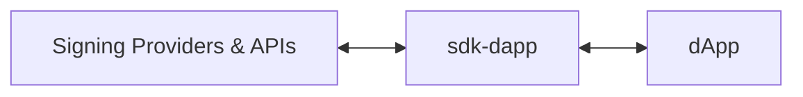
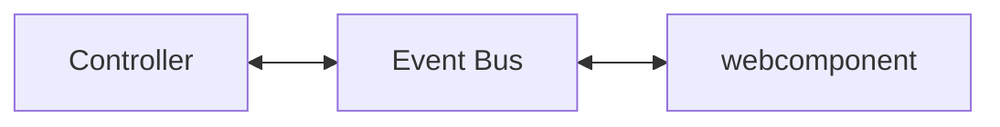

# MultiversX SDK for Front-End DApps

MultiversX Front-End SDK for JavaScript and TypeScript (written in TypeScript).

## Introduction

`sdk-dapp` is a library that holds core functional logic that can be used to create a dApp on MultiversX Network.

It is built for applications that use any of the following technologies:

- React
- Angular
- Vue
- Any other JavaScript framework (e.g. Solid.js etc.)
- React Native
- Next.js

## GitHub project

The GitHub repository can be found here: [https://github.com/multiversx/mx-sdk-dapp](https://github.com/multiversx/mx-sdk-dapp)

## Live demo: template-dapp

See [Template dApp](https://template-dapp.multiversx.com/) for live demo or checkout usage in the [Github repo](https://github.com/multiversx/mx-template-dapp)

## Requirements

- Node.js version 20.13.1+
- Npm version 10.5.2+

## Distribution

[npm](https://www.npmjs.com/package/@multiversx/sdk-dapp)

## Installation

The library can be installed via npm or yarn.

```bash
npm install @multiversx/sdk-dapp
```

or

```bash
yarn add @multiversx/sdk-dapp
```

If you need only the core behaviour, without the additional UI, you can create a project-specific `.npmrc` file to configure per-package installation behavior. This will skip the installation of `@multiversx/sdk-dapp-ui`, but keep in mind that you may need to provide the UI components yourself.
Also, make sure you run your app on `https`, not `http`, otherwise some providers will not work.

```bash
## .npmrc
@multiversx/sdk-dapp:omit-optional=true
## enable the option when needed with:
## @multiversx/sdk-dapp:omit-optional=false

## Run Installation
## When you run npm install, NPM will use the configurations specified in the .npmrc file:
npm install
```

If you're transitioning from @multiversx/sdk-dapp, you can check out the [Migration guide PR](https://github.com/multiversx/mx-template-dapp/pull/264) of Template Dapp

## Usage

sdk-dapp aims to abstract and simplify the process of interacting with users' wallets and with the MultiversX blockchain, allowing developers to easily get started with new applications.



The basic concepts you need to understand are configuration, provider interaction, transactions, and presenting data. These are the building blocks of any dApp, and they are abstracted in the `sdk-dapp` library.

Having this knowledge, we can consider several steps needed to put a dApp together:

**Table 1**. Steps to build a dApp
| # | Step | Description |
|---|------|-------------|
| 1 | Configuration | - storage configuration (e.g. sessionStorage, localStorage etc.)<br>- chain configuration<br>- custom provider configuration (adding / disabling / changing providers) |
| 2 | Provider interaction | - logging in and out<br>- signing transactions / messages |
| 3 | Presenting data | - get store data (e.g. account balance, account address etc.)<br>- use components to display data (e.g. balance, address, transactions list) |
| 4 | Transactions | - sending transactions<br>- tracking transactions |

Each of these steps will be explained in more detail in the following sections.

### 1. Configuration

Before your application bootstraps, you need to configure the storage, the network, and the signing providers. This is done by calling the `initApp` method from the `core/methods` folder.

```typescript
// index.tsx
import { initApp } from '@multiversx/sdk-dapp/out/core/methods/initApp/initApp';
import type { InitAppType } from '@multiversx/sdk-dapp/out/core/methods/initApp/initApp.types';
import { EnvironmentsEnum } from '@multiversx/sdk-dapp/out/types/enums.types';
import { App } from "./App";

const config: InitAppType = {
  storage: { getStorageCallback: () => sessionStorage },
  dAppConfig: {
    // nativeAuth: true, // optional
    environment: EnvironmentsEnum.devnet,
    // network: { // optional
    //   walletAddress: 'https://devnet-wallet.multiversx.com'
    // },
    successfulToastLifetime: 5000
  }
  // customProviders: [myCustomProvider] // optional
};

initApp(config).then(() => {
  render(() => <App />, root!); // render your app
});
```

### 2. Provider interaction

Once your dApp has loaded, the first user action is logging in with a chosen provider.

```typescript
import { ProviderTypeEnum } from '@multiversx/sdk-dapp/out/core/providers/types/providerFactory.types';
import { ProviderFactory } from '@multiversx/sdk-dapp/out/core/providers/ProviderFactory';

const provider = await ProviderFactory.create({
  type: ProviderTypeEnum.extension
});
await provider.login();
```

### 3. Displaying user data

Depending on the framework, you can either use hooks or selectors to get the user details:

#### React hooks solution:

```typescript
import { useGetAccount } from '@multiversx/sdk-dapp/out/store/selectors/hooks/account/useGetAccount';
import { useGetNetworkConfig } from '@multiversx/sdk-dapp/out/store/selectors/hooks/network/useGetNetworkConfig';

const account = useGetAccount();
const {
  network: { egldLabel }
} = useGetNetworkConfig();

console.log(account.address);
console.log(`${account.balance} ${egldLabel}`);
```

#### Store selector functions:

```typescript
import { getAccount } from '@multiversx/sdk-dapp/out/core/methods/account/getAccount';
import { getNetworkConfig } from '@multiversx/sdk-dapp/out/core/methods/network/getNetworkConfig';

const account = getAccount();
const { egldLabel } = getNetworkConfig();
```

### 4. Transactions

#### Signing transactions

To sign transactions, you first need to create the `Transaction` object then pass it to the initialized provider.

```typescript
import { Transaction, TransactionPayload } from '@multiversx/sdk-core/out';
import {
  GAS_PRICE,
  GAS_LIMIT
} from '@multiversx/sdk-dapp/out/constants/mvx.constants';
import { getAccountProvider } from '@multiversx/sdk-dapp/out/core/providers/helpers/accountProvider';
import { refreshAccount } from '@multiversx/sdk-dapp/out/utils/account/refreshAccount';

const pongTransaction = new Transaction({
  value: '0',
  data: new TransactionPayload('pong'),
  receiver: contractAddress,
  gasLimit: GAS_LIMIT,
  gasPrice: GAS_PRICE,
  chainID: network.chainId,
  nonce: account.nonce,
  sender: account.address,
  version: 1
});

await refreshAccount(); // optionally, to get the latest nonce
const provider = getAccountProvider();
const signedTransactions = await provider.signTransactions(transactions);
```

#### Sending and tracking transactions

Then, to send the transactions, you need to use the `TransactionManager` class and pass in the signedTransactions to the send method. You can optionally track the transactions by using the track method. This will create a toast notification with the transaction hash and its status.

```typescript
import { TransactionManager } from '@multiversx/sdk-dapp/out/core/managers/TransactionManager';

const txManager = TransactionManager.getInstance();
await txManager.send(signedTransactions);
await txManager.track(signedTransactions);
```

Once the transactions are executed on the blockchain, the flow ends with the user logging out.

```typescript
import { getAccountProvider } from '@multiversx/sdk-dapp/out/core/providers/helpers/accountProvider';
const provider = getAccountProvider();
await provider.logout();
```

## Internal structure

We have seen in the previous chapter what are the minimal steps to get up and running with a blockchain interaction using sdk-dapp. Next we will detail each element mentioned above

**Table 2**. Elements needed to build a dApp
| # | Type | Description |
|---|------|-------------|
| 1 | Network | Chain configuration |
| 2 | Provider | The signing provider for logging in and singing transactions |
| 3 | Account | Inspecting user address and balance |
| 4 | Transactions Manager | Sending and tracking transactions |
| 5 | UI Components | Displaying UI information like balance, public keys etc. |

Since these are mixtures of business logic and UI components, the library is split into several folders to make it easier to navigate.
When inspecting the package, there is more content under `src`, but the main folders of interest are:

```bash
src/
├── apiCalls/ ### methods for interacting with the API
├── constants/ ### useful constants from the ecosystem like ledger error codes, default gas limits for transactions etc.
├── controllers/ ### business logic for UI elements like transactions and amount formatting
├── core/ ### hosting the provider class, and all implementations for different signing providers
└── store/ ### store initialization, middleware, slices, selectors and actions
```

Conceptually, these can be split into 3 main parts:

- First is the business logic in `apiCalls`, `constants` and `core` (signing providers).
- Then comes the persistence layer hosted in the `store` folder, using [Zustand](https://zustand.docs.pmnd.rs/) under the hood.
- Last are the UI components hosted in [@multiversx/sdk-dapp](https://github.com/multiversx/mx-sdk-dapp-ui) with some components controlled on demand by classes defined in `controlles`

Next, we will take the elements from Table 2 and detail them in the following sections.

### 1. Network

The network configuration is done in the `initApp` method, where you can make several confgurations like:

- specifying the environment (devnet, testnet, mainnet)
- overriding certain network parameters like wallet address, explorer address etc.

Once the network is configured, the `network` slice in the store will hold the network configuration.

To query different network parameters, you can use the `getNetworkConfig` method from the `core/methods/network` folder.

### 2. Provider

The provider is the main class that handles the signing of transactions and messages. It is initialized in the `initApp` method and can be accessed via the `getAccountProvider` method from the `core/providers/helpers` folder.

#### Initialization

It's important to initialize it on app load (this is take care of by `initApp`), since it restores the session from the store and allows signing transactions without the need to make a new login.

#### Creating a custom provider

If you need to create a custom signing provider, make sure to extend the `IProvider` interface and implement all required methods (see example [here](https://github.com/multiversx/mx-template-dapp/tree/main/src/provider)). Next step would be to include it in the `customProviders` array in the `initApp` method or add it to the [window object](https://github.com/multiversx/mx-template-dapp/tree/main/src/initConfig). Last step is to login using the custom provider.

```typescript
import { ProviderTypeEnum } from '@multiversx/sdk-dapp/out/core/providers/types/providerFactory.types';

const ADDITIONAL_PROVIDERS = {
  myCustomProvider: 'myCustomProvider'
} as const;

// do this if you want to reference it later in your code
const ExtendedProviders = {
  ...ProviderTypeEnum,
  ...ADDITIONAL_PROVIDERS
} as const;

const provider = await ProviderFactory.create({
  type: ExtendedProviders.myCustomProvider // or add a simple string here
});
await provider?.login();
```

#### Accessing provier methods

Once the provider is initialized, you can get a reference to it using the `getAccountProvider` method. Then you can call the `login`, `logout`, `signTransactions`, `signMessage` methods, or other custom methods depending on the intialized provider (see ledger for example).

### 3. Account

#### Getting account data

Once the user logs in, a call is made to the API for fetching the account data. This data is persisted in the store and is accessible through helpers found in `core/methods/account`. These functions are:

**Table 3**. Getting account data
| # | Helper | Description | React hook equivalent |
|---|------|-------------|----|
| | `core/methods/account` | path | `store/selectors/hooks/account` |
| 1 | `getAccount()` | returns all account data |`useGetAccount()` |
| 2 | `getAddress()` | returns just the user's public key | `useGetAddress()`|
| 3 | `getIsLoggedIn()` | returns a login status boolean | `useGetIsLoggedIn()` |
| 4 | `getLatestNonce()` | returns the account nonce | `useGetLatestNonce()`

#### Nonce management

sdk-dapp has a mechanism that does its best to manage the account nonce. For example, if the user sends a transaction, the nonce gets incremented on the client so that if he sends a new transaction, it will have the correct increased nonce. If you want to make sure the nonce is in sync with the API account, you can call `refreshAccount()` as shown above in the **Signing transactions** section.

### 4. Transactions Manager

#### Overview

The `TransactionManager` is a class that handles sending and tracking transactions in the MultiversX ecosystem. It provides methods to send single and batch transactions while handling tracking, error management, and toasts for user notifications. It is initialized in the `initApp` method and can be accessed via `TransactionManager.getInstance()`.

#### Features

- **Supports Single and Batch Transactions:** Handles individual transactions as well as grouped batch transactions.
- **Automatic Tracking:** Monitors transaction status and updates accordingly through a webhook or polling fallback mechanism.
- **Toast Notifications:** Displays status updates for user feedback, with options to disable notifications and customize toast titles.
- **Error Handling:** Catches and processes errors during transaction submission

#### Transactions Lifecycle

The transaction lifecycle consists of the following steps:

1. **Creating** a `Transaction` object using the `@multiversx/sdk-core provider`
2. **Signing** the transaction with the initialized provider and receiving a `SignedTransactionType` object
3. **Sending** the signed transaction using TransactionManager's `send()` function. Signed transactions can be sent in 2 ways:

**Table 4**. Sending signed transactions
| # | Signature | Method | Description |
|---|------|-------------|-------------|
| 1 | `send([tx1, tx2])` | `POST` to `/transactions` | Transactions are executed in parallel
| 2 | `send([[tx1, tx2], [tx3]])` | `POST` to `/batch` | First batch of two transactions is executed, and the second batch of one transaction waits for the finished results, and is then executed

4. **Tracking** transactions is made by using `transactionManager.track()`. Since the `send()` function returns the same arguments it has received, the same array payload can be passed into the `track()` method. Under the hood, status updates are received via a WebSocket or polling mechanism.
   Once a transaction array is tracked, it gets associated with a `sessionId`, returned by the `track()` method and stored in the `transactions` slice. Depending on the array's type (plain/batch), the session's status varies from initial (`pending`/`invalid`/`sent`) to final (`successful`/`failed`/`timedOut`).

5. **User feedback** is provided through toast notifications, which are triggered to inform about transactions' progress. Additional tracking details can be optionally displayed in the toast UI.
There is an option to add custom toast messages by using the `createCustomToast` helper.

```ts
import { createRoot } from 'react-dom/client';
import { createCustomToast } from '@multiversx/sdk-dapp/out/store/actions/toasts/toastsActions';

// by creating a custom toast element containing a component
createCustomToast({
  toastId: 'username-toast',
  instantiateToastElement: () => {
    const toastBody = document.createElement('div');
    const root = createRoot(toastBody);
    root.render(<ReloadButton />);
    return toastBody;
  }
});

// or by creating a simple custom toast
createCustomToast({
  toastId: 'custom-toast',
  icon: 'times',
  iconClassName: 'warning',
  message: 'This is a custom toast',
  title: 'My custom toast'
});
      

```

6. **Error Handling & Recovery** is done through a custom toast that prompts the user to take appropriate action.

#### Methods

1. Sending Transactions

In this way, all transactions are sent simultaneously. There is no limit to the number of transactions contained in the array.

```ts
const transactionManager = TransactionManager.getInstance();
const parallelTransactions: SigendTransactionType[] = [tx1, tx2, tx3, tx4];
const sentTransactions = await transactionManager.send(parallelTransactions);
```

2. Sending Batch Transactions

In this sequential case, each batch waits for the previous one to complete.

```ts
const transactionManager = TransactionManager.getInstance();
const batchTransactions: SignedTransactionType[][] = [
  [tx1, tx2],
  [tx3, tx4]
];
const sentTransactions = await transactionManager.send(batchTransactions);
```

3. Tracking Transactions

The basic option is to use the built-in tracking, which displays toast notifications with default messages.

```ts
const sessionId = await transactionManager.track(
  sentTransactions
  // { disableToasts: true } optionally disable toast notifications
);
```

If you want to provide more human-friendly messages to your users, you can enable tracking with custom toast messages:

```ts
const sessionId = await transactionManager.track(sentTransactions, {
  transactionsDisplayInfo: {
    errorMessage: 'Failed adding stake',
    successMessage: 'Stake successfully added',
    processingMessage: 'Staking in progress'
  }
});
```

**Tracking transactions without being logged in**

If your application needs to track transactions sent by a server and the user does not need to login to see the outcome of these transactions, there are several steps that you need to do to enable this process.

Step 1. Enabling the tracking mechanism

By default the tracking mechanism is enabled only after the user logs in. That is the moment when the WebSocket connection is established. If you want to enable tracking before the user logs in, you need to call the `trackTransactions` method from the `core/methods/trackTransactions` folder. This method will enable a polling mechanism.

```typescript
import { trackTransactions } from '@multiversx/sdk-dapp/out/core/methods/trackTransactions/trackTransactions';

initApp(config).then(async () => {
  await trackTransactions(); // enable here since by default tracking will be enabled only after login
  render(() => <App />, root!);
});
```

Then, you can track transactions by calling the `track` method from the `TransactionManager` class with a plain transaction containing the transaction hash.

```typescript
import { Transaction, TransactionsConverter } from '@multiversx/sdk-core/out';

const tManager = TransactionManager.getInstance();
const txConverter = new TransactionsConverter();
const transaction = txConverter.plainObjectToTransaction(signedTx);

const hash = transaction.getHash().toString(); // get the transaction hash

const plainTransaction = { ...transaction.toPlainObject(), hash };
await tManager.track([plainTransaction]);
```

#### Advanced Usage

If you need to check the status of the signed transactions, you can query the store direclty using the `sessionId` returned by the `track()` method.

```ts
import { getStore } from '@multiversx/sdk-dapp/out/store/store';
import { transactionsSliceSelector } from '@multiversx/sdk-dapp/out/store/selectors/transactionsSelector';

const state = transactionsSliceSelector(getStore());
Object.entries(state).forEach(([sessionKey, data]) => {
  if (sessionKey === sessionId) {
    console.log(data.status);
  }
});
```

### 5. UI Components

sdk-dapp needs to make use of visual elements for allowing the user to interact with some providers (like the ledger), or to display messages to the user (like idle states or toasts). These visual elements consitst of webcomponents hosted in the `@multiversx/sdk-dapp-ui` package. Thus, sdk-dapp does not hold any UI elements, just business logic that controls external components. We can consider two types of UI components: internal and external. They are differentiated by the way they are controlled: private components are controlled by sdk-dapp's signing or logging in flows, while public components can be controlled by the dApp.

#### Public components

#### Private components

The way private components are controlled are trough a [pub-sub pattern](https://en.wikipedia.org/wiki/Publish%E2%80%93subscribe_pattern) called EventBus. Each webcomponent has a method of exposing its EventBus, thus allowing sdk-dapp to get a reference to it and use it for communication.



```typescript
const modalElement = await createUIElement<LedgerConnectModal>(
  'ledger-connect-panel'
);
const eventBus = await modalElement.getEventBus();
eventBus.publish('TRANSACTION_TOAST_DATA_UPDATE', someData);
```

If you want to override private components and create your own, you can implement a similar strategy, of course by respecting each webcomponent's API (see an interface example [here](https://github.com/multiversx/mx-sdk-dapp/blob/main/src/core/providers/strategies/LedgerProviderStrategy/types/ledger.types.ts)).

## Debugging your dApp

The recommended way to debug your application is by using [lerna](https://lerna.js.org/). Make sure you have the same package version in sdk-daap-core's package.json and in your project's package.json.

If you preffer to use [npm link](https://docs.npmjs.com/cli/v11/commands/npm-link), make sure to use the `preserveSymlinks` option in the server configuration:

```js
  resolve: {
    preserveSymlinks: true, // 👈
    alias: {
      src: "/src",
    },
  },
```

To build the library, run:

```bash
npm run build
```

To run the unit tests, run:

```bash
npm test
```
