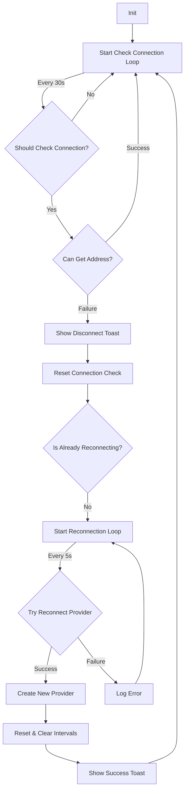

# Ledger Idle State Manager

The Ledger Idle State Manager is responsible for maintaining and monitoring the connection state between the application and a Ledger hardware wallet. It implements an automated reconnection mechanism to ensure a seamless user experience when interacting with the Ledger device.

## Process Flow

The manager implements a two-tier monitoring system:

1. **Connection Check Loop** (30s interval)
   - Continuously monitors the Ledger connection state
   - Verifies if the current provider is Ledger and an address exists
   - Attempts to get the device address to confirm connectivity
   - Triggers reconnection process if connection fails

2. **Reconnection Process** (5s interval)
   - Activates when connection check fails
   - Attempts to create a new provider instance
   - Continues until successful reconnection
   - Provides user feedback through toast notifications

## Flow Diagram

## Key Timings

- Connection Check Interval: 30 seconds
- Reconnection Attempt Interval: 5 seconds
- Success Notification Duration: 3 seconds

## User Feedback

The manager provides user feedback through toast notifications:

- **Disconnection**: "Ledger disconnected - Unlock your device to continue signing transactions"
- **Reconnection**: "Ledger reconnected - Your device is ready to sign transactions"

## Implementation Details

The manager is implemented as a singleton class that:
- Maintains its own connection check and reconnection intervals
- Integrates with the application's store for provider type and address information
- Handles cleanup of intervals when resetting or reconnecting
- Provides toast notifications for important state changes

## Usage

The manager is automatically instantiated and managed by the SDK. No direct interaction is required from the application code. It will automatically:
- Start monitoring when a Ledger provider is active
- Handle disconnections and reconnections
- Clean up resources when switching providers or logging out
